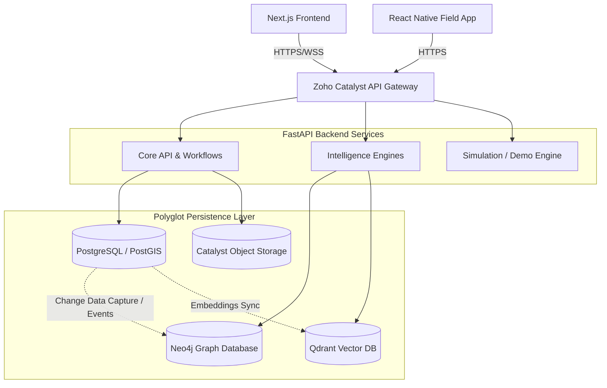

# Prahari AI — System Architecture

Prahari AI utilizes a **Polyglot Persistence Architecture**, decoupling operational workloads from analytical, search, and graph traversal workloads. The entire stack is orchestrated for deployment on **Zoho Catalyst**.

## High-Level Architecture

## Technology Stack

1. **Frontend**: Next.js (React 19), TailwindCSS, Zustand
2. **Visualizations**: MapLibre GL JS (Geospatial), Cytoscape.js (Graph), Apache ECharts (Analytics)
3. **Backend**: FastAPI (Python 3.12), Pydantic, SQLAlchemy
4. **Relational Database**: PostgreSQL (Operational state, RBAC, Core Entities)
5. **Graph Database**: Neo4j (Link Analysis, Criminal Networks, Shortest Path)
6. **Vector Database**: Qdrant (Semantic Search, AI RAG)
7. **Cloud Infrastructure**: Zoho Catalyst (Serverless, AppSail, Object Storage)

## Core Workflows

- **FIR Registration**: The Progressive FIR Workflow saves drafts to PostgreSQL incrementally. Upon submission, a background task synchronizes the FIR entities into Neo4j nodes and Qdrant vectors.
- **Simulation Engine**: Developed in Python, generates realistic synthetic cases spanning decades to ensure the system is evaluated under high-volume stress (100,000+ records).
